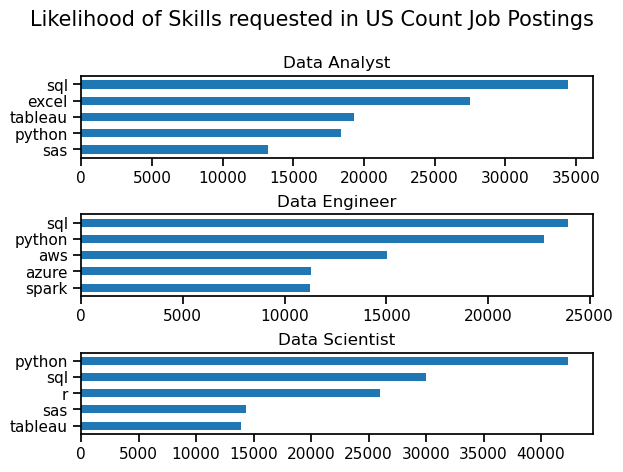

# Overview

Welcome to my analysis of the job market, focusing on data analyst roles. This was created a desire to navigate and understand the job market more effectively. it delves into the top-paying and in-demand skills to help find optimal job opportunities for data analysts.

The data sourced from Luke Barousse's python course which provides a foundation for my analysis, containing detailed information on job titles, salaries, locations, and essential skills. Through scripts, I explore key questions such as the most demanded skills, salary trends, and the intersection of the demand and salary in data analytics.


# Questions
Below are the questions I want to answer in my project:

1. What are the skills most in demand for the top 3 most popular data roles?
2. How are In-demand skills trending for Data Analysts?
3. How well do jobs and skills pay for Data Analysts?
4. what are the optimal skills for data analysts to learn (High Demand AND High Paying) 

# Tools I used 

For my deep dive into the data analyst job market, i harnessed the power of several key tools:

    Python: The back bone of my analysis, allowing me to analyze the data and find the criticsl insights. i also  used the following python libraries
        
        Pandas Library: This was used to analyze the data.
        Matplotlib Library: I visualised the data.
        Seaborn Library: Helped me create more advanced visuals.

    Jupyter Notebooks: The tool I used to run my python scripts which let me easily include my notes and analysis.
    Visual Studio Code: My go-to for executing python scrpits.
    Git and Github: Essential for version control and sharing my python code and analysis ensuring collaboration.

    Data Preparation and Cleanup

    This section outlines the steps taken to prepare the data for analysis, ensuring accuracy and usability.

    Import & Clean Up Data

    I start by importing libraries and loading the dataset, followed by initial data cleaning task to ensure data integrity. 


# The Analysis

Each jupyter notebook for this project aimed at investigating specific aspects of the data job market. Here is how I approached each question:

## 1. What are the most demanded skills for the top 3 most data roles?

To find the most demanded skills for the top 3 most popular data roles. I filtered out those positions by which ones were the most popular, and got the top 5 skills for these top 3 roles. This query highligts the most popular job titles and their top skills, showing which skills i should pay attention to depending on the role I'm targetting.


View my notebook with details steps here: [2_skill_demand.ipynb](3_Project\2_Skill_Demand.ipynb)

### Visualize Data

```python
fig, ax = plt.subplots(len(job_titles), 1)

for i, job_title in enumerate(job_titles):
    df_plot = df_skills_count[df_skills_count['job_title_short'] == job_title].head(5)
    df_plot.plot(kind='barh', x='job_skills', y='skill_count', ax=ax[i], title=job_title)

    ax[i].invert_yaxis()
    ax[i].set_ylabel('')
    ax[i].legend().set_visible(False) 

fig.suptitle('Likelihood of Skills requested in US Count Job Postings', fontsize = 15)
fig.tight_layout(h_pad=0.5) #fix the overlap
plt.show()
```

### Results


Bar graph visualising the salary for the top 3 data roles and their top 5 skills associated each.
### Insights
-Python is a versatile skill, highly demanded across all three roles, but most prominently for Data Scientists(72%) and Data Engineers (65%).
-SQL is the most requested skill for Data Analysts and Data Scientists, with it in over half of the job postings for both roles. For Data Engineers, Python is the best sought-after skill, appearing in 68% of the job postings
-Data Engineers require more specialised technical skills(AWS, Azure, Spark) compared to Data Analysts and Data Scientists who are expected to be proficient in more data management and analysis tools (Excel, Tableau).

# What I Learned 

Through out this project, I deepened my understanding of the data analyst job market and enhanced my technical skills in python, especially in data manipulation and visualization. Here are a few specific things i learned:

 -Advanced python usage: Utilizing libraries such as Pandas, Seaborn, and Matplotlib, for data visualization, and other libraries helped me perform complex data, analysis tasks more efficiently.
 -Data Cleaning Importance: I learned that through data cleaning and preparation are crucial before any analysis can be conducted, ensuring the accuracy of insights derived from the data.
 -Strategic Skill Analysis: The project emphasized the importance of aligning one's skills with market demand. Understanding the relationship between Skill demand, salary, and job availability allows for more strategic career planning in the tech industry.


 # Insights


# Challenges I faced


# Conclusion


 
 
 ### Note: This project is still a work in progress. I will continue updating it to address the questions I mentioned above.